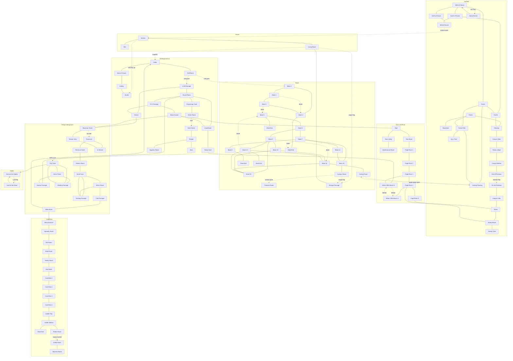

# Zork I — Room Connection Map

**Legend**
- `---` open bidirectional passage
- `-.->` conditional or one-way passage
- `-->` strictly one-way
- Edge labels describe the condition or notable direction
- *diode* = maze one-way warning passage (no return)

